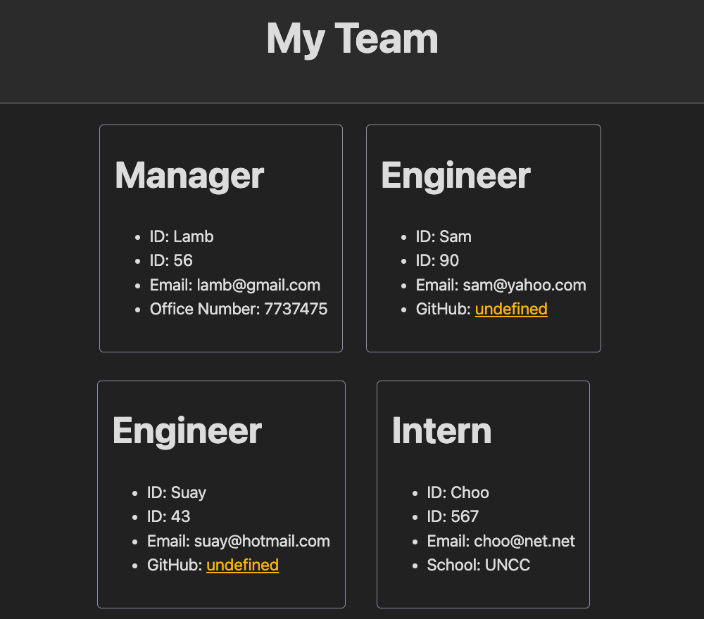

# [Team](https://drive.google.com/file/d/14hXvCwXkBIykzCq4sz9FhRC-AfK7dJlY/view)

[Link to this project's repository](https://github.com/Saidou25/Team)

[View a quick demo](https://drive.google.com/file/d/1NpSii_hqOYo4JwmBGBhkXMlcY5ffgp0w/view?usp=sharing)

## Table of Contents
- [Description](#description)
- [Technology](#technology)
- [Installation](#installation)
- [Visuals](#visuals)

## Description

"Team" is a node.js application that generates a webpage displaying cards of team members.
Information for each employee are entered via Vscode's Terminal.

## Technology

- `node.js`
- `inquirer`
- `jest`

## Installation

. Fork the repository
. Open live server
. In the cli type node index.js
. Answer the prompts

## Visuals

This is a screenshot of what is presented to the user when all prompts have been answered. Team members's cards have been generated :

